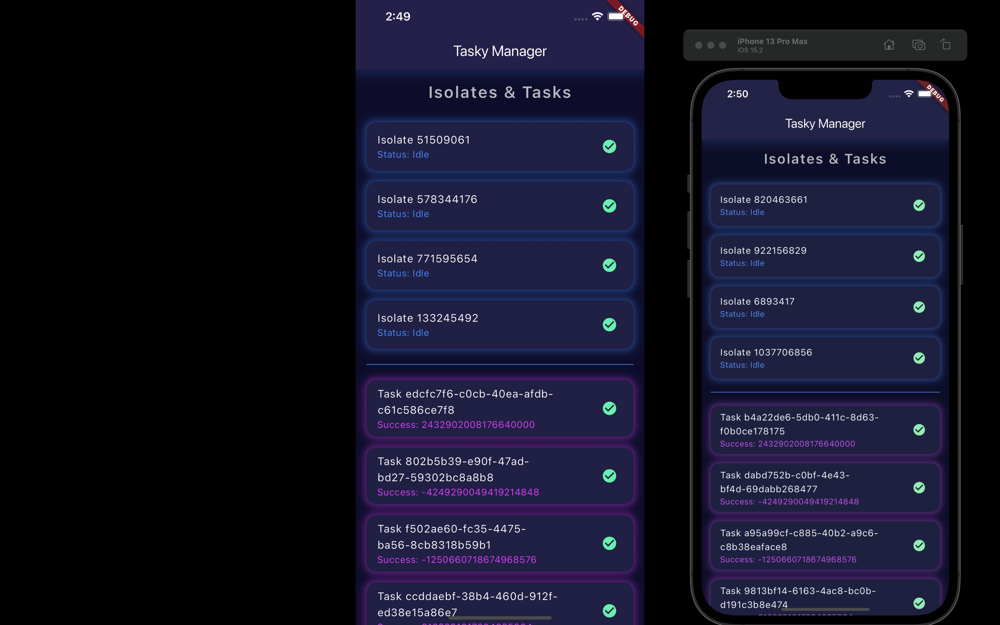

# 🛠️ Tasky - Dart Isolate-based Task Manager

### 😱 Ever noticed your Flutter app slowing down?

We've all been there! You've built this awesome app, but suddenly, your heavy tasks—like long computations or intense network calls—start dragging everything down. Of course, Dart **isolates** are here to save the day... but how easy are they to work with? Let's be honest—**isolates** can be intimidating and scare many developers away.

That's where **Tasky** comes in! 🎉

`Tasky` takes the complexity out of working with Dart isolates by providing a **simple and powerful task management system** that handles asynchronous, long-running tasks with ease. Say goodbye to performance hiccups and hello to smooth, non-blocking apps! 🚀

---

## ✨ Features

- ⚡ **Priority-based task management**: Ensures high-priority tasks are executed first.
- 🎛️ **Dynamic isolate spawning**: Automatically scales the number of isolates based on the current workload.
- 🔄 **Task retries**: Failed tasks can be automatically retried a configurable number of times.
- 📡 **Task result streaming**: Get real-time updates on task progress and results.
- 🛠️ **Isolate health monitoring**: Monitor the status of isolates and their workloads.
- ❌ **Task cancellation**: Kill a running task if necessary.

---

## 🚨 Problem Statement

In Flutter (and Dart in general), the main thread handles most of your app's work, including UI rendering and user interactions. When you throw in heavy tasks—like large computations, image processing, or continuous I/O operations—things can slow down, leading to laggy or unresponsive apps. 😓

Sure, Dart offers **isolates** to run these tasks off the main thread, but:

- 🧩 Managing isolates manually is **complex** and time-consuming.
- 🕹️ Handling **task priorities**, retries, and scheduling can feel like a mini-project.
- 📉 Keeping track of memory usage and optimizing resource allocation is a real challenge.

Without proper tools, developers often shy away from isolates, leading to bottlenecks and poor app performance.

---

## 🎯 How `Tasky` Solves These Problems

`Tasky` is your go-to tool for managing long-running or CPU-intensive tasks in Flutter apps. It abstracts away the complexity of working with Dart isolates and provides a **priority-based task queue**. Whether you're dealing with hundreds of network requests, data-heavy computations, or any kind of parallel processing, **Tasky** takes care of:

- ✅ Task **scheduling** and **execution** with priority control.
- 🔄 Automated **retry mechanism** for failed tasks.
- 📡 **Live status updates** for running isolates and tasks.
- 🛠️ **Automatic scaling** of isolates based on the workload.
- 📉 Monitoring memory usage to prevent overloading the system.

With **Tasky**, you don’t need to be an isolate expert. You can focus on building amazing features while **Tasky** handles the heavy lifting.

---

## 📦 Installation

Add the following to your `pubspec.yaml`:

```yaml
dependencies:
  tasky: ^0.0.1
```

Then run:

```bash
flutter pub get
```

---

## 💻 Usage

Here’s how you can start using `Tasky` in your Flutter app.

### 1. Import the package

```dart
import 'package:tasky/tasky.dart';
```

### 2. Create an instance of `TaskyManager`

```dart
final taskyManager = TaskyManager(isolateCount: 4, maxIsolates: 10);
```

I would recommend using your dependency injection package here to have a singleton Tasky instance which you can access from anywhere in your app. for example getIt / injectable


### 3. Adding tasks

You can add tasks to the manager by specifying a function, arguments, and priority:

```dart
void myTaskFunction(String param1, int param2) {
  // Your task logic here
  print('Task executed with $param1 and $param2');
}

void main() {
  // Add a task to the manager
  taskyManager.addTask(myTaskFunction, ['Hello', 42], priority: 1);
}
```

### 4. Stream results

Listen for task results using a result stream:

```dart
final taskId = taskyManager.addTask(myTaskFunction, ['Hello', 42], priority: 1);

taskyManager.getResultStream(taskId).listen((result) {
  if (result.error != null) {
    print('Task failed: ${result.error}');
  } else {
    print('Task completed in ${result.duration}: ${result.result}');
  }
});
```

### 5. Monitoring isolate status

Monitor the status of isolates as they process tasks:

```dart
taskyManager.getIsolateStatusesStream().listen((statuses) {
  for (var status in statuses) {
    print('Isolate: ${status['isolate']}, Task: ${status['currentTaskId']}');
  }
});
```

### 6. Cancelling a task

If a task is taking too long, you can cancel it:

```dart
bool killed = taskyManager.killTask(taskId);
if (killed) {
  print('Task $taskId was cancelled.');
} else {
  print('Task $taskId could not be found or was not running.');
}
```

---

## 🔧 TaskBuilder Use Case

Let’s say you want to manage tasks easily in your UI and provide real-time result updates. With **Tasky**, you can achieve this by using the `TaskBuilder` widget, which makes managing tasks in a Flutter app much easier and more streamlined.

Use `TaskBuilder` to manage task execution and result handling right from your widget tree, giving you real-time updates on long-running tasks and handling all the complexities of isolates for you!
See Example
```dart 
    TaskBuilder(
                manager: manager, // getIt<TaskyManager>()
                function: computeFactorial,
                args: const [20],
                priority: 1,
                onResult: (taskResult) {
                  return Text(
                    "The factorial of 20 is ${taskResult.result} calculated in ${taskResult.duration.inSeconds} seconds with memory usage of ${taskResult.memoryUsage}"
                    
                  );
                },
            )
```

---

## 🌟 Use Cases

1. **Long-Running Calculations**: Offload resource-heavy computations (e.g., processing large datasets, AI model inference) to isolates without blocking the main thread.
   
2. **I/O Intensive Operations**: Parallelize file operations or network requests and execute them in a prioritized manner.

3. **Real-Time Applications**: In real-time systems, some tasks need immediate attention while others can wait. With **Tasky**, you can assign priorities to tasks and make sure the critical ones are handled first.

4. **Retry for Unstable Tasks**: Automatically retry tasks prone to failure (e.g., network issues) with a configurable retry limit.

5. **Optimizing Memory Usage**: **Tasky** helps prevent memory leaks by monitoring the memory usage of isolates, providing efficient resource management.

---

## 💡 Value to Developers

- **🚀 Improved Performance**: Keep your Flutter app smooth and responsive by offloading tasks to isolates.
  
- **🧠 Smart Task Management**: Automatically prioritize and execute tasks, simplifying complex workflows.

- **🛡️ Enhanced Error Handling**: Let **Tasky** handle retries for failed tasks, so you don't have to.

- **⚙️ Simplified Isolate Management**: Focus on building features, while **Tasky** takes care of scaling and managing isolates.

- **📈 Scalability and Efficiency**: Handle thousands of tasks without slowing down, with **Tasky** dynamically managing the number of isolates.

---

## 🤝 Contributing

We welcome contributions! Feel free to submit pull requests or open issues for any bugs, feature requests, or improvements.

## 📄 License

This project is licensed under the MIT License - see the [LICENSE](LICENSE) file for details.
